# JSH Motorcycle Spare Parts — ERP System

A full-stack, production-grade Enterprise Resource Planning (ERP) system built with **TypeScript** end-to-end. Designed for a small-to-medium retail and wholesale motorcycle spare parts business, it covers the complete operational lifecycle — point of sale, inventory, supplier procurement, customer credit tracking, multi-branch management, and admin reporting.

Built as a real-world client solution and presented here as a portfolio piece demonstrating practical TypeScript, Next.js App Router, and database design skills.

---

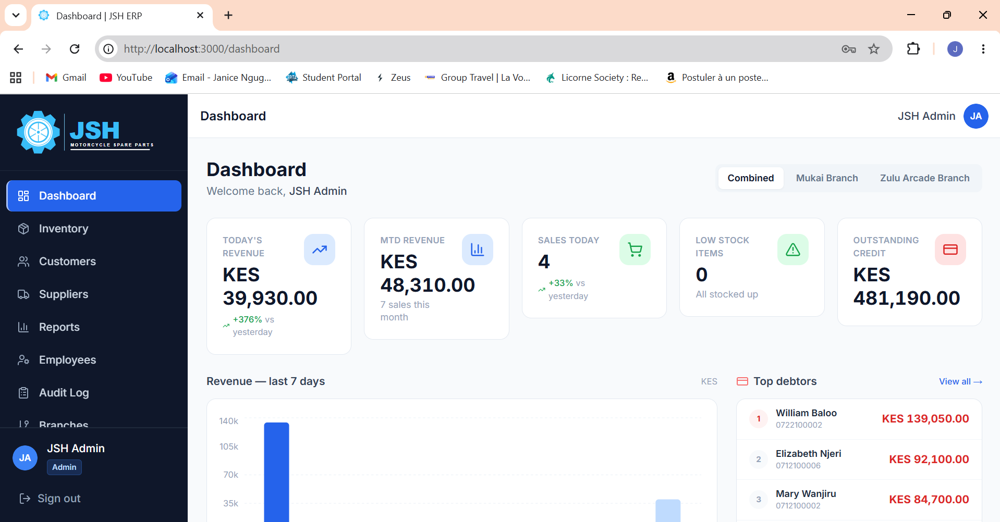

---

## Tech Stack

| Layer | Technology |
|---|---|
| Language | TypeScript (strict mode, end-to-end) |
| Framework | Next.js 14 (App Router) |
| Styling | Tailwind CSS + shadcn/ui |
| Database | PostgreSQL (Supabase) |
| ORM | Prisma 5 |
| Authentication | NextAuth.js v5 (credentials provider, JWT) |
| State management | Zustand (POS cart) |
| Charts | Recharts |
| Validation | Zod + React Hook Form |
| Runtime | Node.js |

---

## Features

### Point of Sale

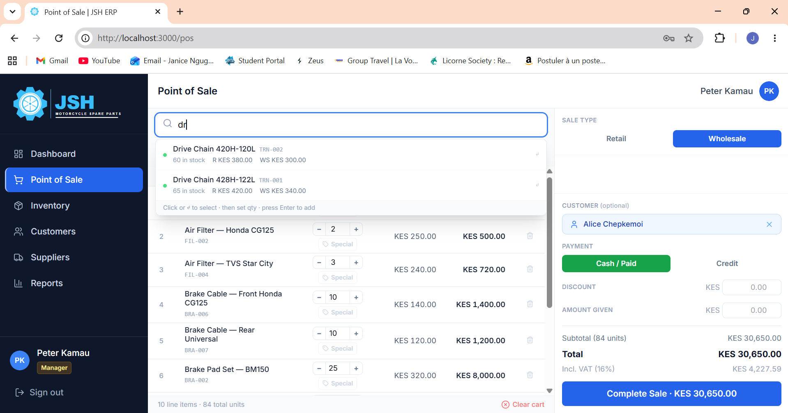

- Live item search by name or SKU (debounced, up to 15 results, branch-scoped)
- Three dynamic price tiers per item: **Retail**, **Wholesale**, and **Special** (special is optional; POS hides it for items where it isn't configured)
- Sale type switcher — all cart prices update instantly when switching between retail and wholesale
- Attach a customer to any sale; mark the sale as **Paid** or **On Credit**
- Discount input and amount-given field with live change calculation
- Stock validation before completing a sale — the server checks branch stock and rejects the sale if any item is unavailable
- Atomic sale completion: creates the sale record, decrements branch stock, and updates the customer credit balance in a single database transaction

**Thermal receipt printing**

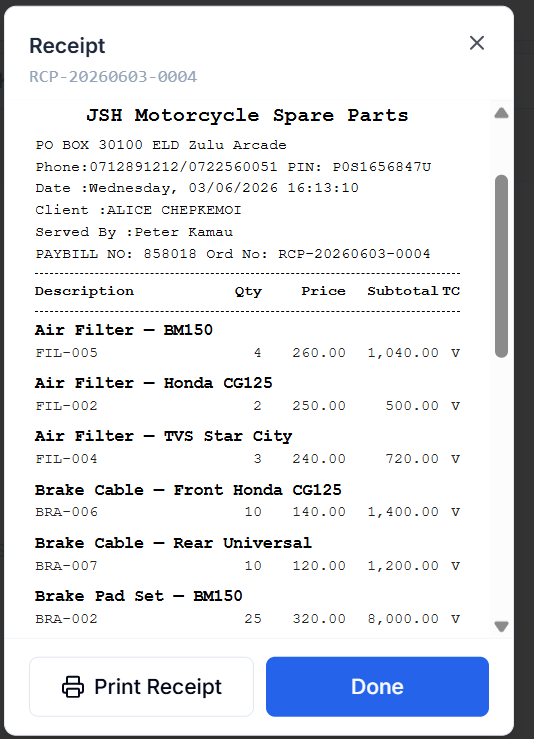

- Unique receipt number in format `RCP-YYYYMMDD-XXXX` (e.g. `RCP-20260601-0042`)
- Shop header: name, address, phone — pulled from the branch that made the sale
- Served-by name, date, and time
- Itemised list with SKU, quantities, and unit prices (price snapshot — historic receipts are never affected by future price changes)
- Subtotal (ex-VAT), extracted VAT (16% Kenya VAT), total, discount, and change
- Customer name and credit status on credit sales
- QR code linking to the branch WhatsApp number
- VAT code footer: `CODE V: VAT= 16%  CODE E: EXEMPT= 0%`

---

### Dashboard

**Admin view — multi-branch comparison**


- System-wide totals at a glance
- Per-branch cards, each showing:
  - Today's revenue and sales count
  - Outstanding customer credit
  - Low-stock alert count
  - 7-day revenue bar chart (Recharts, daily breakdown)
  - Top 5 selling items by quantity
  - Top 5 debtors by credit balance

**Manager / Cashier view — single branch**

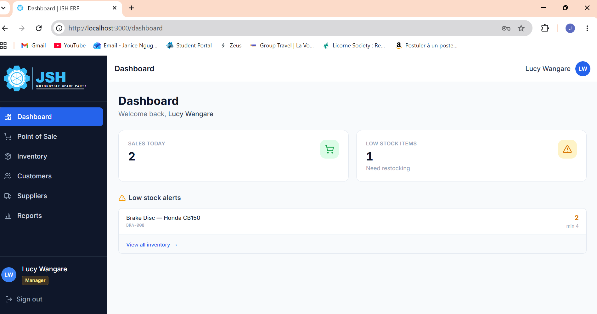

- Today's sales count and total revenue
- Low-stock alert list (item name, current quantity vs. threshold)

---

### Inventory Management

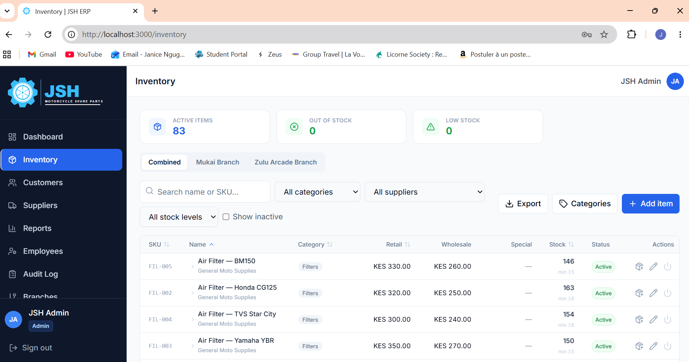

- Summary stats: total items, active items, low-stock count
- Add and update items with SKU, category, description, supplier link, and three price tiers
- Per-item, per-branch **low-stock threshold** (default 5 units; configurable)
- **Stock In dialog** — record a purchase order from a supplier; automatically increments the branch's stock
- Soft delete: deactivate/reactivate items — no data is ever permanently lost
- Category management: create and filter items by category
- Stock auto-decrements on completed sales; auto-restores on voided receipts
- Admin sees stock across all branches; non-admin sees only their branch

---

### Customer Management

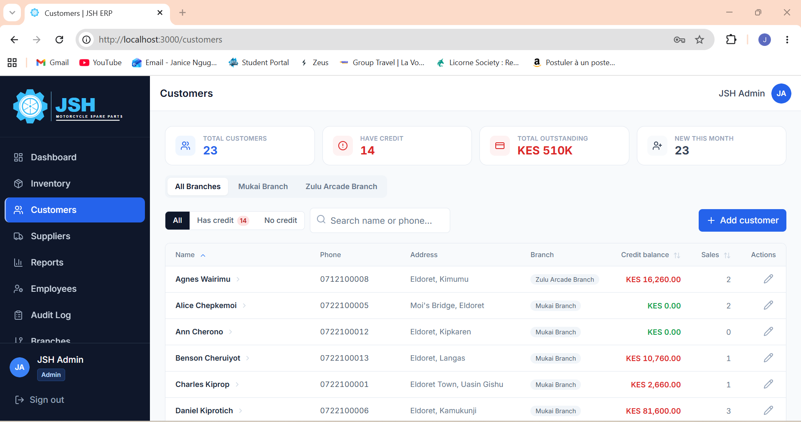

- Customer records with name, phone, address, and branch
- Summary stats: total customers, customers with outstanding credit, total credit owed, new this month
- Filter by credit status: All / Has Credit / No Credit
- Branch-scoped: non-admin users only see customers from their branch

**Customer detail page**

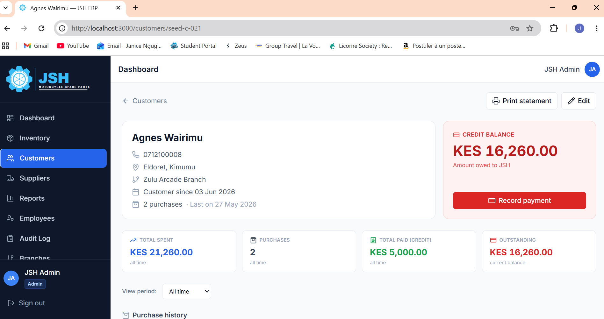

- Complete purchase history (receipt number, type, status, total, date)
- Full credit payment history including the employee who recorded each payment
- **Record credit payment** — atomic transaction: creates the payment record and decrements the customer's balance simultaneously

---

### Supplier Management

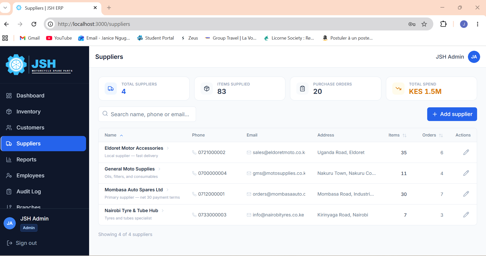

- Supplier records: name, phone, email, address, notes
- Summary stats: total suppliers, total items sourced, total purchase orders, total spend (calculated from cost prices)
- **Record Purchase Order** — add multiple line items in one order; atomically creates each order line and increments branch stock

**Supplier detail page**

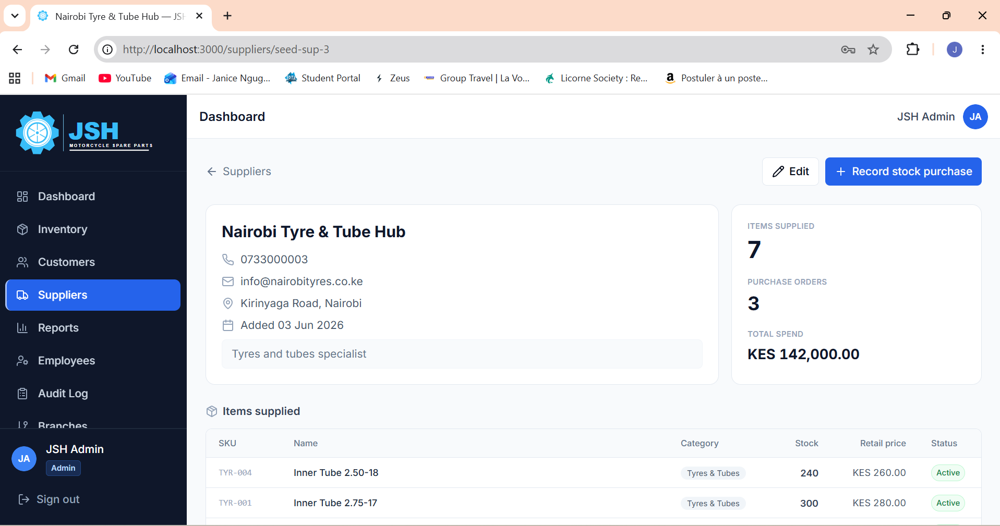

- Lists all items supplied (with SKU, category, prices, current stock)
- Full purchase order history (quantity, cost, date, recorder name)

---

### Reports

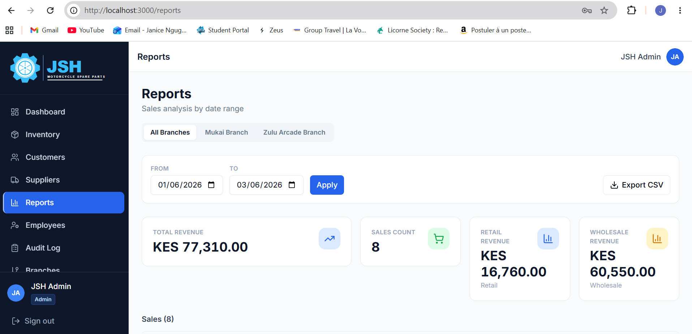

- Role-gated: **Manager and Admin only**
- Filter sales by custom date range
- Revenue breakdown: total, retail-only, and wholesale-only
- Full receipt history table: receipt number, date, sale type, customer, total, payment status
- **Void receipt** (Admin only) — marks the sale as void, records the void reason and timestamp, and restores stock for all items in the receipt
- CSV export of the current report view
- Admin can view all branches or filter to a single branch; Managers see only their branch

---

### Employee Management

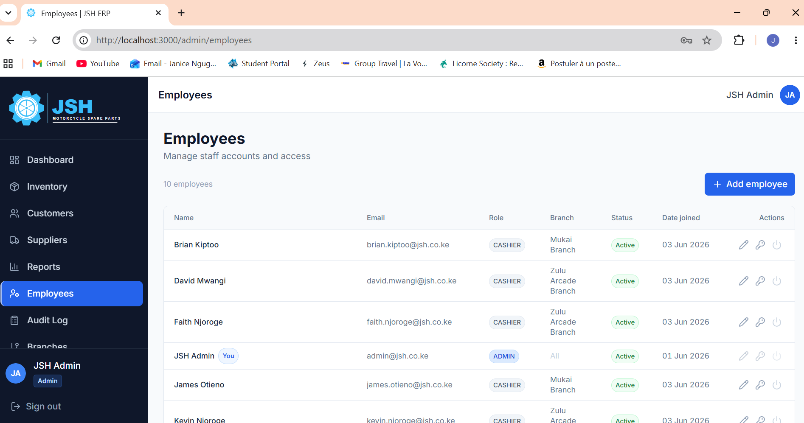

- Admin-only access
- Create employee accounts with role assignment: **Cashier**, **Manager**, or **Admin**
- Assign employees to specific branches
- Activate / deactivate accounts (soft delete)
- Reset passwords (bcrypt-hashed on the server)
- Per-employee sales activity: sales count and total revenue

---

### Branch Management

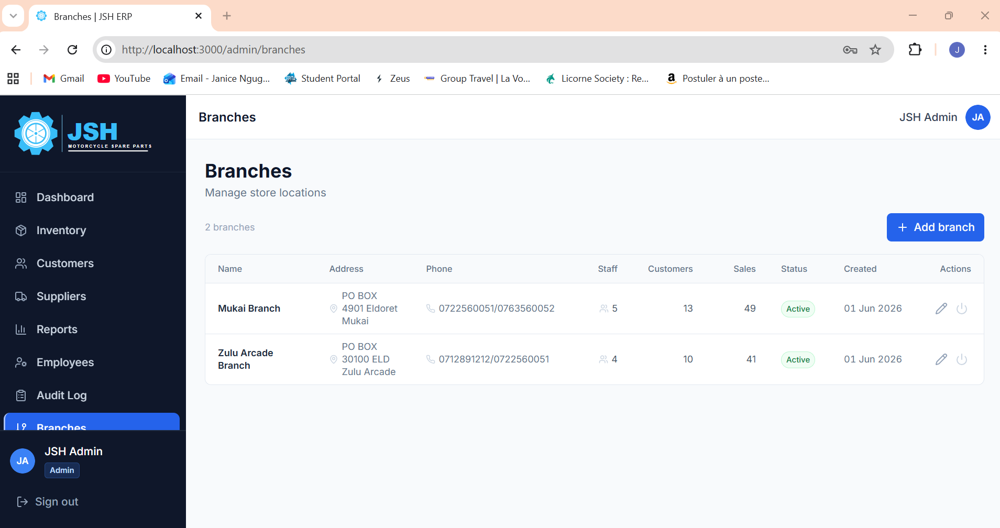

- Admin-only access
- Create and manage store locations: name, address, phone, Paybill number, PIN
- Per-branch stats: employee count, customer count, total sales
- Activate / deactivate branches without losing historical data

---

### Audit Log

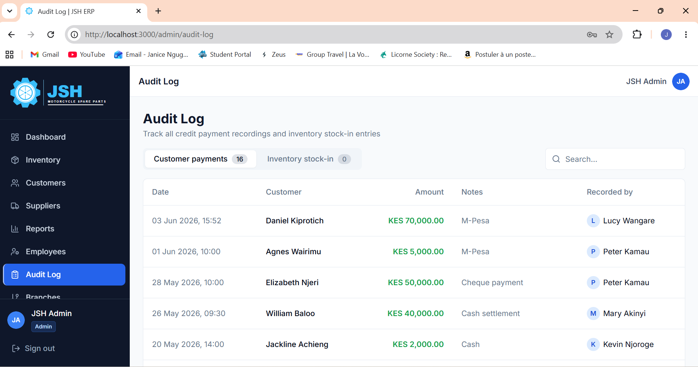

- Admin-only access
- Immutable trail of all credit payment recordings and stock-in events
- Each entry shows: date, action type, item or customer, quantity, and the employee who performed the action

---

## Role-Based Access Control

Three roles enforced at the **middleware level** — no role checks scattered across page components:

```
CASHIER   → POS · Inventory (view + edit) · Customers · Suppliers
MANAGER   → Everything above + Reports
ADMIN     → Full access: Employees · Branches · Audit Log · Void receipts · Export data
```

Non-admin users are automatically scoped to their assigned branch across all views.

---

## Architecture Highlights

### Price snapshot
`SaleItem.unitPrice` stores the exact price at the time of sale. Historic receipts are never affected by future price changes.

### Atomic transactions
All multi-step writes use **Prisma `$transaction()`** — either every step commits or nothing does:
- Sale creation → stock decrement → credit balance update
- Credit payment → balance decrement
- Purchase order → stock increment
- Void receipt → stock restore

### VAT handling (Kenya)
Prices are stored and displayed VAT-inclusive (16%). The server extracts VAT from totals using `total × (16/116)` so receipt calculations are always correct regardless of client-side rounding.

### Branch-scoped data
Every query for inventory, customers, sales, and suppliers is filtered by the user's branch unless the user is an Admin, who sees cross-branch data with per-branch breakdowns.

### Type safety
- Prisma generates fully-typed models used directly in server actions
- Zod schemas validate all form inputs before they reach the database
- `useSession()` typed with the custom session shape (`id`, `name`, `email`, `role`, `branchId`)
- No `any` types in the codebase

---

## Database Schema

9 models across two logical groups:

**Sales & inventory**
`User` → `Sale` → `SaleItem` ← `Item` ← `BranchStock`

**People, finance & procurement**
`Customer` → `CreditPayment`, `Supplier` → `Item` → `PurchaseOrder`

Supporting: `Branch`, `Category`, `StockLog`

---

## Project Structure

```
├── app/
│   ├── (auth)/login/             # Login page
│   └── (dashboard)/
│       ├── dashboard/            # Main dashboard
│       ├── pos/                  # Point of sale
│       ├── inventory/            # Inventory management
│       ├── customers/            # Customer list + [id] detail page
│       ├── suppliers/            # Supplier list + [id] detail page
│       ├── reports/              # Sales reports (manager+)
│       └── admin/
│           ├── employees/        # Employee management (admin)
│           ├── branches/         # Branch management (admin)
│           └── audit-log/        # Audit trail (admin)
├── components/
│   ├── pos/                      # POS panel, search, cart, receipt modal
│   ├── receipt/                  # 80mm thermal receipt layout
│   ├── inventory/
│   ├── customers/
│   ├── suppliers/
│   ├── dashboard/                # Metric cards, charts, top-items, top-debtors
│   ├── reports/
│   ├── admin/
│   ├── audit/
│   ├── layout/                   # Sidebar, top bar, dashboard shell
│   └── ui/                       # shadcn/ui components
├── lib/
│   ├── actions/                  # Server actions (pos, inventory, customers, etc.)
│   ├── validations/              # Zod schemas
│   ├── store/                    # Zustand cart store
│   ├── constants/                # Shop info, VAT rate
│   └── db.ts                     # Prisma client singleton
├── prisma/schema.prisma
├── screenshots/                  # Feature screenshots
├── auth.ts                       # NextAuth config
├── auth.config.ts                # Edge-safe config (for middleware)
└── middleware.ts                 # Route protection + role guards
```

---

## Getting Started

```bash
# Install dependencies
npm install

# Set environment variables
cp .env.example .env
# Fill in DATABASE_URL, DIRECT_URL, NEXTAUTH_SECRET

# Push schema to database
npm run db:push

# Seed sample data
npm run db:seed

# Start development server
npm run dev
```

### Available scripts

| Script | Description |
|---|---|
| `npm run dev` | Development server |
| `npm run build` | Production build |
| `npm run start` | Production server |
| `npm run db:push` | Sync Prisma schema with database |
| `npm run db:migrate` | Create a new migration |
| `npm run db:studio` | Open Prisma Studio |
| `npm run db:seed` | Seed database with sample data |
| `npm run db:reset` | Wipe all data except admin user and branches |

---

## Author

**Janice Ngugi**  
GitHub: [@janicefoi](https://github.com/janicefoi)
